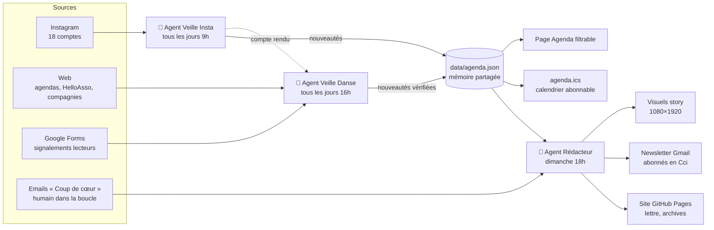

# Huit Temps · 5 · 6 · 7 · 8

**Une newsletter danse hebdomadaire produite par un système d'agents IA.**
Chaque dimanche : battles, stages, auditions et spectacles, avec un focus Nouvelle-Aquitaine et un regard sur toute la France.

🔗 **Site** : [tinyurl.com/huit-temps](https://tinyurl.com/huit-temps) · [Agenda](https://nicolasbaudoin.github.io/huit-temps/agenda.html) · [Trainings libres](https://nicolasbaudoin.github.io/huit-temps/trainings.html) · [Calendrier .ics](https://nicolasbaudoin.github.io/huit-temps/agenda.ics) · [Soutenir sur Ko-fi](https://ko-fi.com/huittemps)

---

## Le projet en deux phrases

Je suis danseur, et je galérais à trouver les infos danse récentes : stages annoncés seulement en story Insta, battles sur HelloAsso, auditions dans des PDF.
Huit Temps est une **chaîne d'agents IA autonomes** qui fait cette veille chaque jour, construit un agenda structuré et publie une newsletter, un site et des visuels Instagram, sans intervention manuelle.

> Deuxième projet que je construis avec **Claude Code**, dans le cadre de ma reconversion vers le **développement IA agentique**, en parallèle de mon cursus à **42**.

---

## Architecture agentique



| Agent | Rôle | Outils (MCP et natifs) | Garde-fous |
|---|---|---|---|
| **Veille Insta** (9h) | Lit les comptes de studios et de crews, extrait les événements | Navigateur intégré, Gmail | Lecture seule (aucun like ni message), scan **incrémental** (état du dernier post vu) |
| **Veille Danse** (16h) | Recherche web par région, vérifie, enrichit l'agenda, traite les signalements | WebSearch, Google Drive, Gmail, git | **Budget de 15 recherches par run**, calendrier fixe des régions, vérification du jour de la semaine |
| **Rédacteur** (dimanche) | Sélectionne, rédige, publie et envoie | Gmail, Google Drive, git, scripts Node | Revérifie seulement les items à la une, données d'abonnés jamais écrites dans le dépôt |

---

## Ce que ce projet m'a fait pratiquer (côté dev IA agentique)

- **Orchestration multi-agents asynchrone** : trois agents planifiés qui communiquent par une **mémoire partagée structurée** (`agenda.json`) et par des messages (emails de compte rendu), et non par un seul gros prompt.
- **Optimisation des tokens** :
  - la mémoire du « déjà vu » évite de rechercher deux fois la même info ;
  - le scan Instagram est incrémental ;
  - chaque agent a un budget de recherches ;
  - le choix du modèle se fait par tâche (un modèle léger pour la collecte, un plus puissant pour la rédaction).
- **Séparer le LLM du déterministe** : l'IA collecte, juge et rédige. Le calendrier `.ics`, les pages et les visuels de story sont générés par des **scripts Node sans dépendance**, donc sans token et de façon reproductible.
- **Tool use via MCP** : Gmail, Google Drive, navigateur, recherche web, git.
- **Garde-fous et éthique** :
  - lecture seule sur les réseaux sociaux ;
  - données personnelles isolées et jamais publiées (RGPD, mentions légales) ;
  - interdiction d'inventer une info, avec une source obligatoire pour chaque item.
- **Humain dans la boucle** : la rubrique « Coup de cœur » est écrite par moi. L'agent l'intègre **sans la réécrire**.
- **Prompt engineering de production** : des prompts autonomes, versionnés, avec des cas d'échec explicites (outil indisponible, Sheet illisible, push refusé…).
- **Contraintes réelles du front** : un email qui résiste au mode sombre de Gmail mobile, un format iCalendar (RFC 5545, fins de ligne CRLF), une page responsive.

---

## Stack

- **Agents** : Claude (via Claude Code et ses tâches planifiées), avec Opus pour la rédaction et Sonnet pour la collecte
- **Outils** : MCP Gmail et Google Drive, navigateur intégré, WebSearch
- **Données** : `data/agenda.json` (agenda public), Google Sheets (abonnés et signalements, privés)
- **Front** : HTML et CSS sans framework, GitHub Pages
- **Scripts** : Node.js sans dépendance, Edge headless pour le rendu des visuels

## Arborescence

```
├── index.html               # inscription / désinscription, soutien, calendrier
├── lettre.html              # dernier numéro (et gabarit de la lettre)
├── agenda.html              # agenda filtrable (lit data/agenda.json en direct)
├── trainings.html           # trainings libres par ville
├── mentions-legales.html
├── agenda.ics               # calendrier abonnable (généré)
├── archives/                # tous les numéros
├── stories/                 # visuels Instagram de chaque semaine (générés)
├── data/agenda.json         # mémoire partagée des agents
└── scripts/
    ├── build-agenda.js        # agenda.json → agenda.ics
    ├── build-agenda-page.js   # génère agenda.html
    ├── pages.js               # génère trainings.html et mentions-legales.html
    ├── build-stories.js       # agenda.json → visuels story 1080×1920
    └── build-promo-story.js   # visuel « Abonne-toi »
```

## Lancer les scripts

```bash
node scripts/build-agenda.js          # régénère agenda.ics
node scripts/build-stories.js         # visuels story (sélection auto, ou passer des id)
node scripts/build-agenda-page.js     # après un changement de design de l'agenda
node scripts/pages.js                 # après un changement des pages secondaires
```

> Sous Windows, `build-stories.js` est à lancer depuis PowerShell (rendu Edge headless).

---

## Auteur

**Nicolas Baudoin** (Kassoup), danseur hip-hop et freestyle, étudiant à **42**, en route vers le développement IA agentique.
Projet construit en pair-programming avec [Claude Code](https://claude.com/claude-code).

Les infos publiées viennent de sources publiques citées. Pour une correction ou un événement à ajouter, utilise le [formulaire de signalement](https://docs.google.com/forms/d/e/1FAIpQLScX4Ho4S7FMhxda1UpL8GkvDDvrCxvvpW4WfMQ2mwsQijr3yA/viewform).
